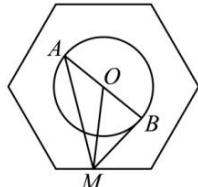

> [!faq]- 全练一本通解析
> **【答案】** [2,3]
>
> **【解析】**
> 连接 AB, OM, 如图所示:
> 
> $\overrightarrow{MA} \cdot \overrightarrow{MB} = (\overrightarrow{MO} + \overrightarrow{OA}) \cdot (\overrightarrow{MO} + \overrightarrow{OB}) = \overrightarrow{MO}^2 + \overrightarrow{MO} \cdot \overrightarrow{OA} + \overrightarrow{MO} \cdot \overrightarrow{OB} + \overrightarrow{OA} \cdot \overrightarrow{OB}$ $= |\overrightarrow{MO}|^2 + \overrightarrow{MO} \cdot (\overrightarrow{OA} + \overrightarrow{OB}) - 1 = |\overrightarrow{MO}|^2 - 1.$
> 根据图形可知, 当点 M 位于正六边形各边的中点时, $\left|MO\right|$ 有最小值为 $\sqrt{3}$ , 此时 $\left|\overrightarrow{MO}\right|^{2}-1=2$ ,
> $$
> 2 \leq \overrightarrow {M A} \cdot \overrightarrow {M B} \leq 3
> $$
> $$
> \left| \overrightarrow {M O} \right| ^ {2} - 1 = 3
> $$
> $$
> \overrightarrow {M A} \cdot \overrightarrow {M B}
> $$
