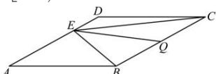

> [!faq]- 全练一本通解析
> **【答案】** $[0, + \infty)$
>
> **【解析】**
> 
> 取 BC 的中点 Q，连接 EQ，则 $\overrightarrow{EB} + \overrightarrow{EC} = 2\overrightarrow{EQ}$ ，
> 所以 $\overrightarrow{EB} \cdot \overrightarrow{EC} = \frac{1}{4}[(\overrightarrow{EB} + \overrightarrow{EC})^2 - (\overrightarrow{EB} - \overrightarrow{EC})^2] = \frac{1}{4}(4|\overrightarrow{EQ}|^2 - |\overrightarrow{CB}|^2) = |\overrightarrow{EQ}|^2 - 1,$
> 当且仅当 $EQ \perp BC$ 时，EQ 有最小值，则 $\left|\overrightarrow{EQ}\right|^{2}-1$ 有最小值，
> 此时菱形的面积
> $$
> E Q \times B C = 2 \times \frac {1}{2} \times A B \times A D \times \sin 3 0 ^ {\circ} \Rightarrow E Q \times 2 = 2 \times \frac {1}{2} \times 2 \times 2 \times \frac {1}{2} \Rightarrow E Q = 1
> $$
> $$
> \left| \overrightarrow {E Q} \right| ^ {2} - 1
> $$
> $$
> 1 - 1 = 0
> $$
> 因为 E 是边 AD 所在直线上的一点, 所以 EQ 无最大值, $\left|\overrightarrow{EQ}\right|^{2}-1$ 无最大值, $\overrightarrow{EB} \cdot \overrightarrow{EC}$ 的取值范围为 $\left[0,+\infty\right)$ , 故答案为: $\left[0,+\infty\right)$
