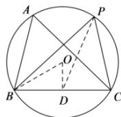

> [!faq]- 全练一本通解析
> **【答案】** 详见解析
>
> **【解析】**
> 解析: 设 $\triangle ABC$ 外接圆的半径为 R，由正弦定理可得 $2R=\frac{BC}{\sin A}=\frac{2\sqrt{3}}{\sin\frac{\pi}{3}}=4$ 所以 R=2 ，如图设 $\triangle ABC$ 外接圆的圆心为 O，D 为 BC 的中点，连接 OD, OB, PD,
> 
> 则 $OD \perp BC, OB = 2, DB = \sqrt{3}$ ,
> 所以 OD = 1，
> 因为 $\overrightarrow{PB} = \overrightarrow{PD} + \overrightarrow{DB}, \overrightarrow{PC} = \overrightarrow{PD} + \overrightarrow{DC} = \overrightarrow{PD} - \overrightarrow{DB}$ 所以 $\overrightarrow{PB}\cdot\overrightarrow{PC}=\left(\overrightarrow{PD}+\overrightarrow{DB}\right)\cdot\left(\overrightarrow{PD}-\overrightarrow{DB}\right)=\overrightarrow{PD}^{2}-\overrightarrow{DB}^{2}=\overrightarrow{PD}^{2}-3$ 由圆的性质可知 $2-1 \leq PD \leq 2+1$ ，即 $PD \in [1,3]$ ，
> 所以 $\overrightarrow{PD}^{2}-3\in[-2,6]$ ，即 $\overrightarrow{PB}\cdot\overrightarrow{PC}$ 取值范围是 $[-2,6]$ .
> 故答案为： $[-2,6]$ .
