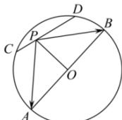

> [!faq]- 全练一本通解析
> **【答案】** $[-4,0]$
>
> **【解析】**
> 由题意知,连接 PO, O 为 AB 的中点,
> 
> 则 $\overrightarrow{PA}=\overrightarrow{PO}+\overrightarrow{OA},\overrightarrow{PB}=\overrightarrow{PO}+\overrightarrow{OB}=\overrightarrow{PO}-\overrightarrow{OA}$ 可得 $\overrightarrow{PA}\cdot\overrightarrow{PB}=(\overrightarrow{PO}+\overrightarrow{OA})\cdot(\overrightarrow{PO}-\overrightarrow{OA})=\overrightarrow{PO}^{2}-\overrightarrow{OA}^{2}=\left|\overrightarrow{PO}\right|^{2}-16$ 又因为 $\left|AB\right|=8,\left|CD\right|=4$ ，则圆心 O 到直线 CD 的距离为 $d=\sqrt{4^{2}-2^{2}}=2\sqrt{3}$ 由点 P 在线段 CD 上可知 $2\sqrt{3}\leq\left|\overrightarrow{PO}\right|\leq4$ ，则 $12\leq\left|\overrightarrow{PO}\right|^{2}\leq16$ 所以 $-4\leq\left|\overrightarrow{PO}\right|^{2}-16\leq0$ ，即 $\overrightarrow{PA}\cdot\overrightarrow{PB}$ 的取值范围为 [-4,0].
> 故答案为：[-4,0].
