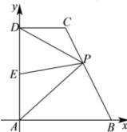

> [!faq]- 全练一本通解析
> **【答案】** $\frac{4}{5}$
>
> **【解析】**
> 在梯形 ABCD 中， $AB//CD,\angle BAD=\frac{\pi}{2},AB=AD=2CD=2$ 以点 A 为坐标原点，AB、AD 所在直线分别为 x、y 轴建立如下图所示的平面直角坐标系 xAy，
> 
> 则 $A(0,0)$ 、 $B(2,0)$ 、 $C(1,2)$ 、 $D(0,2)$ ，设点 E 为线段 AD 的中点，则 $E(0,1)$ ，
> 设 $\overrightarrow{BP} = \lambda \overrightarrow{BC} = \lambda (-1, 2) = (-\lambda, 2\lambda)$ ，其中 $0 \leqslant \lambda \leqslant 1$ ， $\overrightarrow{PA} \cdot \overrightarrow{PD} = (\overrightarrow{PE} + \overrightarrow{EA}) \cdot (\overrightarrow{PE} + \overrightarrow{ED}) = (\overrightarrow{PE} + \overrightarrow{EA}) \cdot (\overrightarrow{PE} - \overrightarrow{EA}) = \overrightarrow{PE}^{2} - \overrightarrow{EA}^{2}$ $\overrightarrow{EP}=\overrightarrow{EA}+\overrightarrow{AB}+\overrightarrow{BP}=(0,-1)+(2,0)+(-\lambda,2\lambda)=(2-\lambda,2\lambda-1)$ 则 $\overrightarrow{PE}=(\lambda-2,1-2\lambda)$ 所以， $\overrightarrow{PA}\cdot\overrightarrow{PD}=\overrightarrow{PE}^{2}-\overrightarrow{EA}^{2}=(\lambda-2)^{2}+(1-2\lambda)^{2}-1$ $=5\lambda^{2}-8\lambda+4=5\left(\lambda-\frac{4}{5}\right)^{2}+\frac{4}{5}\geq\frac{4}{5}$ 当且仅当 $\lambda=\frac{4}{5}$ 时，等号成立，故 $\overrightarrow{PA}\cdot\overrightarrow{PD}$ 的最小值为 $\frac{4}{5}$ .
> 故答案为： $\frac{4}{5}$ .
