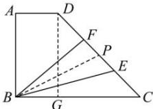

> [!faq]- 全练一本通解析
> **【答案】** 99 148
>
> **【解析】**
> 在 BC 上取一点 G，使得 BG=4，取 EF 的中点 P，连接 DG，BP，如图所示：
> 
> 则 $DG=8\sqrt{3}$ ， $GC=8$ ， $CD=\sqrt{8^{2}+\left(8\sqrt{3}\right)^{2}}=16$ ， $\tan\angle BCD=\frac{8\sqrt{3}}{8}=\sqrt{3}$ ，
> 即 $\angle BCD=60^{\circ}$ 当 $BP \perp CD$ 时， $\left|\overrightarrow{BP}\right|$ 取得最小值，此时 $\left|\overrightarrow{BP}\right|=12\times\sin60^{\circ}=6\sqrt{3}$ ，所以 $\left(\overrightarrow{BE}\cdot\overrightarrow{BF}\right)_{\min}=\left(6\sqrt{3}\right)^{2}-9=99$ .
> 当 F 与 D 重合时，CP=13，BC=12，
> 则 $\left|\overrightarrow{BP}\right|^{2}=12^{2}+13^{2}-2\times12\times13\times\frac{1}{2}=157$ 当 E 与 C 重合时，CP=3，BC=12，
> 则 $\left|\overrightarrow{BP}\right|^{2}=12^{2}+3^{2}-2\times12\times3\times\frac{1}{2}=117$ 所以 $\left(\overrightarrow{BE}\cdot\overrightarrow{BF}\right)_{\max}=157-9=148$ ，故答案为：99；148.
