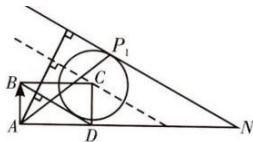

> [!faq]- 全练一本通解析
> **【答案】** A
>
> **【解析】**
> 3
> 解析: 如图, 作 BD 的平行线, 根据相似三角形对应高的比, 发现当平行线过圆心 C 的时候, $m+n=2$ , 当 BD 的平行线 PN 与圆 C 相切时, 即点 P 位于 $P_{1}$ 点时, 此时 $\frac{|AN|}{|AD|}$ 取得最大值, 可以得到 $\frac{|AN|}{|AD|}$ 取得最大比值为 3, 即 $m+n$ 的最大值为 3, 故选 A.
> 
