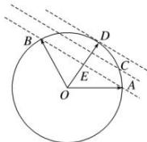

> [!faq]- 全练一本通解析
> **【答案】** [1,2]
>
> **【解析】**
> 令 $x + y = k$ ，如图，在所有与直线 $AB$ 平行的直线中，切线离圆心最远，即此时 $k$ 取得最大值，又 $\angle AOB = \frac{2\pi}{3}$ ，则 $k = \frac{|\overrightarrow{OD}|}{|\overrightarrow{OE}|} = 2.$ 当点 $C$ 在 $A$ （或 $B$ ）处时， $x + y$ 最小为1.故 $x + y$ 的取值范围是[1,2].
> 
