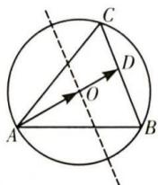

> [!faq]- 全练一本通解析
> **【答案】** $\frac{2}{3}$
>
> **【解析】**
> 由题意可知, O 为 $\triangle ABC$ 外接圆的圆心, 如图所示, 在圆 O 中, 弧 CAB 所对的圆心角为 $\frac{2}{3}\pi$ , 点 A, B 为定点, 点 C 为优弧上的动点, 则点 A, B, C, O 满足题中的已知条件, 延长 AO 交 BC 于点 D, 设 $\overrightarrow{AO} = \lambda \overrightarrow{AD}$ , 根据等和线知识, 则 $m + n$ 的最大值即 $\lambda = \frac{|\overrightarrow{AO}|}{|\overrightarrow{AD}|}$ 的最大值, 由于 $|\overrightarrow{AO}|$ 为定值, 故 $|\overrightarrow{AD}|$ 最小时, $m + n$ 取得最大值, 由几何关系易知当 AB = AC 是, $|\overrightarrow{AD}|$ 取得最小值, 此时 $\lambda = \frac{|\overrightarrow{AO}|}{|\overrightarrow{AD}|} = \frac{2}{3}$ .
> 
