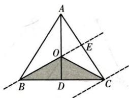

> [!faq]- 全练一本通解析
> **【答案】** (1,2)
>
> **【解析】**
> $M$ 在 $\triangle OBC$ 内（不含边界），如图的阴影部分， $\overrightarrow{AM} = \lambda \overrightarrow{AB} +\mu \overrightarrow{AC} = \lambda \overrightarrow{AB} +2\mu \overrightarrow{AE}$ ，根据等和线原理易知， $M$ 在 $OB$ 边上时， $\lambda +2\mu = 1$ ， $M$ 在 $C$ 点时， $\lambda +2\mu = 2$ ，即 $\lambda +2\mu \in (1,2)$
> 
