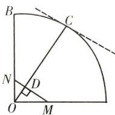

> [!faq]- 全练一本通解析
> **【答案】** $\sqrt{34}$
>
> **【解析】**
> 如图所示，分别取 $\overrightarrow{OM}=\frac{1}{3}\overrightarrow{OA},\overrightarrow{ON}=\frac{1}{5}\overrightarrow{OB},\overrightarrow{OC}=x\overrightarrow{OA}+y\overrightarrow{OB}=3x\overrightarrow{OM}+5y\overrightarrow{ON}$ ，根据等和线知识可得： $3x+5y=\frac{|OC|}{|OD|}$ ，故当OD取得最小值，即 $OD\perp MN$ 时，此时 $|OD|=\frac{|OM|\cdot|ON|}{|MN|}=\frac{1}{\sqrt{34}}$ ，故 $(3x+5y)_{\max}=\sqrt{34}$
> 
