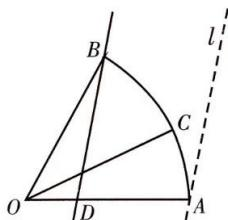

> [!faq]- 全练一本通解析
> **【答案】** [1,3]
>
> **【解析】**
> 如图, 取点 D 使得 $\overrightarrow{OD} = \frac{1}{3}\overrightarrow{OA}, \overrightarrow{OC} = x\overrightarrow{OA} + y\overrightarrow{OB} = 3x\overrightarrow{OD} + y\overrightarrow{OB}$ ，作一系列与 BD 平行的直线与圆弧相交，构造等高线模型，易知：当点 C 与点 A 重合时， $3x + y$ 取最大值 3，点 C 位于直线 BD 上时，（即点 C 与点 B 重合时）， $3x + y$ 取得最小值 1，故 $3x + y$ 的取值范围是 [1,3].
> 
