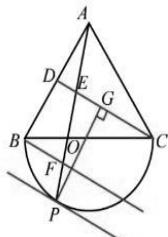

> [!faq]- 全练一本通解析
> **【答案】** $\left[1,\frac{5}{2}\right]$
>
> **【解析】**
> 如图,取 AB 中点为 D,
> 
> $$
> \overrightarrow {A P} = \lambda \overrightarrow {A B} + \mu \overrightarrow {A C} = 2 \lambda \overrightarrow {A D} + \mu \overrightarrow {A C}
> $$
> 显然, 当 P 与 C 重合时, $2\lambda + \mu$ 取最小值 1.
> 将 CD 平行移动至与 $\odot O$ 相切处,
> P 为切点时， $2\lambda + \mu$ 取最大值.
> 延长 $PO$ 交 $CD$ 于 $G$ ，易知 $OG = OF = FP = \frac{1}{2}$ 由等和线及平行截割定理， $\frac{EF}{FP} = 2,\frac{AP}{AE} = \frac{5}{2}$ 所以 $2\lambda +\mu$ 的最大值为 $\frac{5}{2}$ 故 $2\lambda +\mu$ 的取值范围是 $\left[1,\frac{5}{2}\right]$
