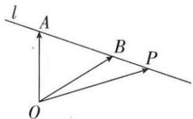

# 第三节 平面向量基本定理

# 第三节 平面向量基本定理

## 知识导学

## 1. 平面向量基本定理

如果 $\vec{e}_1, \vec{e}_2$ 是同一平面内的两个不共线向量，那么对于这一平面内的任一向量 $\vec{a}$ ，有且只用一对实数 $\lambda_1, \lambda_2$ ，使 $\vec{a} = \lambda_1 \vec{e}_1 + \lambda_2 \vec{e}_2$ 。

## 2. 基底

若 $\overrightarrow{e_1},\overrightarrow{e_2}$ 不共线，我们把 $\{\overrightarrow{e_1},\overrightarrow{e_2}\}$ 叫做表示这一平面内所有向量的一个基底.

## 3. 对平面向量基本定理的理解

（1）基底是两个不共线向量

（2）基底不唯一, 只要是同一平面内的两个不共线向量都可以作为基底. 同一非零向量在不同基底下的分解式是不同的.

（3）由于零向量与任何向量都是共线的,因此零向量不能作为基底中的向量.

## 4. 平面向量基本定理的应用

（1）平面向量基本定理唯一性的应用

设 $\vec{a}$ ， $\vec{b}$ 是同一平面的两个不共线向量，若 $x_{1}\vec{a} +y_{1}\vec{b} = x_{2}\vec{a} +y_{2}\vec{b}$ ，则 $\left\{ \begin{array}{l}x_{1} = x_{2}\\ y_{1} = y_{2} \end{array} \right.$

(2) 重要结论

①已知平面上点 O 是直线 l 外一点, A, B 是直线 l 上给

定的两点, 则平面内任意一点 P 在直线 l 上的充要条件是:

存在实数 t，使得 $\overrightarrow{OP} = (1 - t)\overrightarrow{OA} + t\overrightarrow{OB}$ .

特别地, 当 $t=\frac{1}{2}$ 时, 可得点 P 是线段 AB 的中点.

②对于平面内任意一点 O，若存在唯一的一对实数 $\lambda, \mu$ ，使得 $\overrightarrow{OP} = \lambda \overrightarrow{OA} + \mu \overrightarrow{OB}$ ，且 $\lambda + \mu = 1$ ，则 P, A, B 三点共线.

③对于平面内任意一点 O，若 P, A, B 三点共线，则一定存在唯一的一对实数 $\lambda, \mu$ ，使得 $\overrightarrow{OP} = \lambda \overrightarrow{OA} + \mu \overrightarrow{OB}$ ，且 $\lambda + \mu = 1$ .

## ▶ ▷ 核心基础达标

![[高中/课堂同步/题库/高中数学全练一本通/平面向量/第三节 平面向量基本定理/▶基础点 1_ 基底的概念/▶基础点 1_ 基底的概念.md]]
![[高中/课堂同步/题库/高中数学全练一本通/平面向量/第三节 平面向量基本定理/重点题型专练/重点题型专练.md]]
