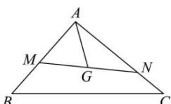

<!-- question-source:start -->
【25】(2022·江西宜春高二期末)如图所示,已知点G是△ABC的重心,过点G作直线分别与AB,AC两边交于M,N两点（点N与点C不重合）,设 $\overrightarrow{AM}=x\overrightarrow{AB},\overrightarrow{AN}=y\overrightarrow{AC}$ ,则 $\frac{1}{x}+\frac{1}{y}$ 的值为（）

A. 3 B. 4 C. 5 D. 6
<!-- question-source:end -->

![[Q00004864A1]]
