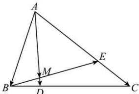

<!-- question-source:start -->
【30】（2023·广西钦州高一校考）如图，在△ABC中，BC=4BD，AC=3CE，BE与AD相交于点M.

（1）用 $\overrightarrow{AB}$ ， $\overrightarrow{AC}$ 表示 $\overrightarrow{AD}$ ， $\overrightarrow{BE}$ ；

(2) 若 $\overrightarrow{AM}=m\overrightarrow{AB}+n\overrightarrow{AC}$ ，求 $m+n$ 的值.
<!-- question-source:end -->

![[Q00004869A1]]
