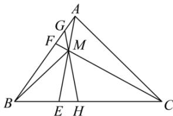

<!-- question-source:start -->
【31】（2023·河南高一校联考期中）如图所示，在 $\triangle ABC$ 中， $\overrightarrow{BE} = \frac{1}{3}\overrightarrow{BC}$ ， $\overrightarrow{BF} = \frac{3}{5}\overrightarrow{BA}$ ， $\left|\overrightarrow{BA}\right| = 4$ ， $\left|\overrightarrow{BC}\right| = 6$ ， $\overrightarrow{BA} \cdot \overrightarrow{BC} = 6$ ， $CF$ 与 $AE$ 相交于点 $M$ 。

(1) 求 $\left|\overrightarrow{BM}\right|$ ;

（2）过点 M 作直线 GH 分别交线段 AB, BC 于点 G, H，记 $\overrightarrow{BG} = \lambda \overrightarrow{BA}$ ， $\overrightarrow{BH} = \mu \overrightarrow{BC}$ ，当 G, H 在线段 BA, BC 上移动时，求 $4\lambda + 3\mu$ 的最小值
<!-- question-source:end -->

![[Q00004870A1]]
