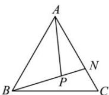

<!-- question-source:start -->
【24】如图, 在 $\triangle ABC$ 中, $\overrightarrow{AN}=2\overrightarrow{NC}$ , P 是 BN 上一点, 若 $\overrightarrow{AP}=t\overrightarrow{AB}+\frac{1}{2}\overrightarrow{AC}$ , 则实数 t 的值为（）

A. $\frac{1}{6}$ B. $\frac{1}{3}$ C. $\frac{1}{4}$ D. $\frac{1}{2}$
<!-- question-source:end -->

![[Q00009198A1]]
