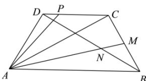

<!-- question-source:start -->
【32】(2024·辽宁高一校考期末)如图,在等腰梯形ABCD中, $AB \parallel DC$ , AB = 2BC = 2CD = 2DA,M为线段BC中点,AM与BD交于点N,P为线段CD上的一个动点.

（1）用 $\overrightarrow{AB}$ 和 $\overrightarrow{AD}$ 表示 $\overrightarrow{AM}$ ;
(2) 求 $\frac{AN}{NM}$ ;
(3) 设 $\overrightarrow{AC}=x\overrightarrow{DB}+y\overrightarrow{AP}$ ，求 xy 的取值范围.
<!-- question-source:end -->

![[Q00009206A1]]
