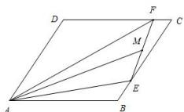

> [!faq]- 全练一本通解析
> **【答案】** D
>
> **【解析】**
> 解析: 因为 \(\overrightarrow{AE} = \overrightarrow{AB} + \overrightarrow{BE} = \overrightarrow{AB} + \frac{1}{5}\overrightarrow{BC} = \overrightarrow{AB} + \frac{1}{5}\overrightarrow{AD},\)
> \(\overline{\textit{\textbf{\textit{\textbf{\textbf{\textbf{\textbf{\textbf{\textbf{\textbf{\textbf{\textbf{\textbf{\textbf{\textbf{\textbf{\textbf{\textbf{\textbf{\textbf{\textbf{\textbf{\textbf{\textbf{\textbf{\textbf{\textbf{\textbf{\textbf{\textbf{\textbf{\textbf{\textbf{\textbf{\textbf{\textbf{\textbf {\textbf{\textbf{\textbf{\textbf{\textbf{\textbf{\textbf{\textbf{\textbf{\textbf{\textbf{\textbf{\textbf{\textbf{\textbf{\textbf{\textbf{\textbf{\textbf{\textbf{\textbf{\textbf{\textbf{\textbf{\textbf{\textbf{\textbf{\textbf{\textbf{\textbf{\textbf{\textbf{\textbf{\x}}}}}}}}}} \\ }}}}}}}}}}\\
> =M 是线段 \(EF\) 的中点,
> 所以 \(\overline{\textit{\textbf{\textbf{\textbf{\textbf{\textbf{\textbf{\textbf{\textbf{\textbf{\textbf{\textbf{\textbf{\textbf{\textbf{\textbf{\textbf{\textbf{\textbf{\textbf{\textbf{\textbf{\textbf{\textbf{\textbf{\textbf{\textbf{\textbf{\textbf{\textbf{\textbf{\textbf{\textbf{x}}}}}}}}}} \\ }}}}}}}}}\\
> =M 是线段 \(EF\) 的中点,
> 所以 \(\overline{\textit{\textbf{\textbf{\textbf{\textbf{x}}}}} = \frac{1}{2}\left(\overline{\textit{\textbf{x}}}\right. + \overline{\textit{\textbf{x}}}}\left.\left.\left.\left.\left.\left.\left.\left.\left.\left.\left.\left.\left.\left.\left.\left.\left.\left.\left.\left.\left.\left.\left.\left.\left.\left.\left.\left.\left.\left.\left.\left.\left.\left.\left.\left.\left.\left.\left.\left.\left.\left.\left.\left.\left.\left.\left.\left.\left.\left.\left|\right|+A\right|+A\right|+A\right|+A\right|+A\right|+A\right|+A\right|+A\right|+A\right|+A\right|+A\right|+A\right|+A\right|+A\right|+A\right|+A\right|+A\right|+A\right|+A\right|+A\right|+A\) 故选: D.
> 
> $$
> - \frac {1}{1 8} \vec {b} + \frac {7}{2 7} \vec {c}
> $$
