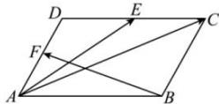

<!-- question-source:start -->
【15】（2023·河北统考模拟）如图, 四边形 ABCD 是平行四边形, 点 E, F 分别为 CD, AD 的中点, 以向量 $\overrightarrow{AE}$ , $\overrightarrow{BF}$ 为基底表示向量 $\overrightarrow{AC}$ .

<!-- question-source:end -->

![[Q00009189A1]]
