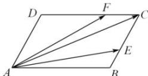

<!-- question-source:start -->
【16】（2022·浙江模拟预测）在平行四边形ABCD中， $\overrightarrow{BE}=\frac{1}{2}\overrightarrow{EC}$ ， $\overrightarrow{DF}=2\overrightarrow{FC}$ ，设 $\overrightarrow{AE}=\vec{a}$ ， $\overrightarrow{AF}=\vec{b}$ ，以 $\vec{a}$ ， $\vec{b}$ 为基底向量表示向量 $\overrightarrow{AC}$ .

<!-- question-source:end -->

![[Q00009190A1]]
