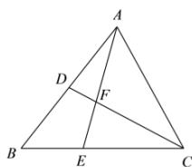

> [!faq]- 全练一本通解析
> **【答案】** D
>
> **【解析】**
> 解析:依题意 $\overrightarrow{AD}=\frac{1}{2}\overrightarrow{AB}$ ，又 $\overrightarrow{CE}=2\overrightarrow{EB}$ ，
> 所以 $\overrightarrow{AE}=\overrightarrow{AB}+\overrightarrow{BE}=\overrightarrow{AB}+\frac{1}{3}\overrightarrow{BC}=\overrightarrow{AB}+\frac{1}{3}\left(\overrightarrow{AC}-\overrightarrow{AB}\right)=\frac{2}{3}\overrightarrow{AB}+\frac{1}{3}\overrightarrow{AC}$ 因为 A、F、E 三点共线, 所以 $\overrightarrow{AF}=\lambda\overrightarrow{AE}=\frac{2\lambda}{3}\overrightarrow{AB}+\frac{\lambda}{3}\overrightarrow{AC}$ 又 D、F、C 三点共线, 所以 $\overrightarrow{AF}=\mu\overrightarrow{AD}+(1-\mu)\overrightarrow{AC}=\frac{1}{2}\mu\overrightarrow{AB}+(1-\mu)\overrightarrow{AC}$ 因为 $\overrightarrow{AB}$ 、 $\overrightarrow{AC}$ 不共线, 所以 $\left\{\begin{aligned}&\frac{2\lambda}{3}=\frac{1}{2}\mu\\&\frac{\lambda}{3}=1-\mu\end{aligned}\right.$ ，解得 $\left\{\begin{aligned}&\lambda=\frac{3}{5}\\&\mu=\frac{4}{5}\end{aligned}\right.$ 所以 $\overrightarrow{AF}=\frac{2}{5}\overrightarrow{AB}+\frac{1}{5}\overrightarrow{AC}=\frac{2}{5}\vec{a}+\frac{1}{5}\vec{b}$
> 
>
> 故选 **D**
