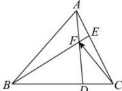

> [!faq]- 全练一本通解析
> **【答案】** A
>
> **【解析】**
> 解析：如图所示
> 解析:如图所示,
> 
> 因为 B, F, E 三点共线且与点 C 不共线，
> 所以 $\overrightarrow{CF} = \lambda \overrightarrow{CB} + (1 - \lambda) \overrightarrow{CE} = \lambda \overrightarrow{CB} + \frac{2}{3}(1 - \lambda) \overrightarrow{CA}$ 同理因为 A, F, D 三点共线且与点 C 不共线，
> 所以 $\overrightarrow{CF} = \mu \overrightarrow{CD} + (1 - \mu) \overrightarrow{CA} = \frac{1}{3} \mu \overrightarrow{CB} + (1 - \mu) \overrightarrow{CA}$ 所以 $\left\{\begin{aligned}\lambda=\frac{1}{3}\mu\\ \frac{2}{3}(1-\lambda)=1-\mu\end{aligned}\right.$ ，解得 $\left\{\begin{aligned}\lambda=\frac{1}{7}\\ \mu=\frac{3}{7}\end{aligned}\right.$ 所以 $\overrightarrow{CF}=\frac{4}{7}\overrightarrow{CA}+\frac{1}{7}\overrightarrow{CB}=\frac{4}{7}\overrightarrow{a}+\frac{1}{7}\overrightarrow{b}$ ，
>
> 故选 **A**
