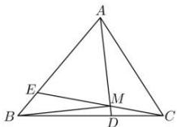

> [!faq]- 全练一本通解析
> **【答案】** A
>
> **【解析】**
> 解析:如图,连接 BM , 设 $\overrightarrow{BM}=\lambda\overrightarrow{BE}+\left(1-\lambda\right)\overrightarrow{BC}=-\frac{1}{4}\lambda\overrightarrow{AB}+\left(1-\lambda\right)\left(\overrightarrow{AC}-\overrightarrow{AB}\right)$ $=\left(\frac{3}{4}\lambda-1\right)\overrightarrow{AB}+\left(1-\lambda\right)\overrightarrow{AC}$ ，由 A、M、D 三点共线，
> 设 $\overrightarrow{CM}=\mu\overrightarrow{CA}+\left(1-\mu\right)\overrightarrow{CD}=-\mu\overrightarrow{AC}+\frac{1}{3}\left(1-\mu\right)\overrightarrow{CB}$ $=-\mu\overrightarrow{AC}+\frac{1}{3}\left(1-\mu\right)\left(\overrightarrow{AB}-\overrightarrow{AC}\right)=\frac{-1-2\mu}{3}\overrightarrow{AC}+\frac{1}{3}\left(1-\mu\right)\overrightarrow{AB}$ 则 $\overrightarrow{AM}=\overrightarrow{AB}+\overrightarrow{BM}=\overrightarrow{AB}+\left(\frac{3}{4}\lambda-1\right)\overrightarrow{AB}+\left(1-\lambda\right)\overrightarrow{AC}=\frac{3}{4}\lambda\overrightarrow{AB}+\left(1-\lambda\right)\overrightarrow{AC}$ $\overrightarrow{AM}=\overrightarrow{AC}+\overrightarrow{CM}=\overrightarrow{AC}+\frac{-1-2\mu}{3}\overrightarrow{AC}+\frac{1}{3}\left(1-\mu\right)\overrightarrow{AB}=\frac{2-2\mu}{3}\overrightarrow{AC}+\frac{1}{3}\left(1-\mu\right)\overrightarrow{A}$ 可得 $\left\{\begin{aligned}&\frac{2-2\mu}{3}=1-\lambda\\&\frac{1}{3}(1-\mu)=\frac{3}{4}\lambda\end{aligned}\right.$ ，解得 $\left\{\begin{aligned}&\mu=\frac{1}{10}\\&\lambda=\frac{2}{5}\end{aligned}\right.$ 所以 $\overrightarrow{AM}=\frac{3}{4}\times\frac{2}{5}\overrightarrow{AB}+\left(1-\frac{2}{5}\right)\overrightarrow{AC}=\frac{3}{10}\overrightarrow{AB}+\frac{3}{5}\overrightarrow{AC}$ . 故选:A.
> 
