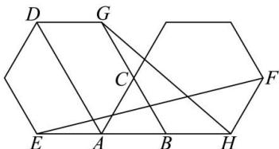

<!-- question-source:start -->
【14】（2023·河南高三校联考期中）已知 $\triangle ABC$ 为等边三角形，分别以 CA, CB 为边作正六边形，如图所示，以 $\overrightarrow{AD}, \overrightarrow{GH}$ 为基底向量表示 $\overrightarrow{EF}$ .

<!-- question-source:end -->

![[Q00004853A1]]
