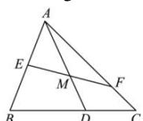

<!-- question-source:start -->
【17】如图， $\triangle ABC$ 中， $E$ 是 $AB$ 的中点， $\overrightarrow{BD} = 2\overrightarrow{DC}$ ， $\overrightarrow{FC} = \frac{1}{3}\overrightarrow{AF}, EF$ 与 $AD$ 交于点 $M$ ，则 $\overrightarrow{AM} = (\quad)$

A. $\frac{3}{14}\overrightarrow{AB} +\frac{3}{7}\overrightarrow{AC}$ B. $\frac{3}{14}\overrightarrow{AB} +\frac{3}{14}\overrightarrow{AC}$ C. $\frac{2}{3}\overrightarrow{AB} +\frac{8}{9}\overrightarrow{AC}$ D. $\frac{3}{7}\overrightarrow{AB} +\frac{4}{7}\overrightarrow{AC}$
<!-- question-source:end -->

![[Q00004856A1]]
