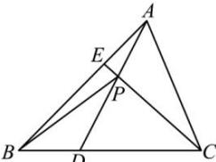

<!-- question-source:start -->
【19】（2023·苏州高一统考）如图，在△ABC中，点D，E分别在边BC和边AB上，D，E分别为BC和BA的三等分点，点D靠近点B，点E靠近点A，AD交CE于点P，设 $\overrightarrow{BC}=\overrightarrow{a}$ ， $\overrightarrow{BA}=\overrightarrow{b}$ ，则 $\overrightarrow{BP}=$ （）

A. $-\frac{1}{7}\vec{a} +\frac{3}{7}\vec{b}$ B. $\frac{1}{7}\vec{a} +\frac{4}{7}\vec{b}$ C. $\frac{1}{7}\vec{a} +\frac{3}{7}\vec{b}$ D. $\frac{2}{7}\vec{a} +\frac{4}{7}\vec{b}$
<!-- question-source:end -->

![[Q00004858A1]]
