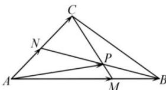

<!-- question-source:start -->
【21】(2022·贵阳一中校联考一模)如图, 在△ABC 中, 点M是AB上的点且满足 $\overrightarrow{AM}=3\overrightarrow{MB}$ , N是AC上的点且满足 $\overrightarrow{AN}=\overrightarrow{NC}$ , CM与BN交于P点, 设 $\overrightarrow{AB}=\vec{a},\overrightarrow{AC}=\vec{b}$ , 则 $\overrightarrow{AP}=$ （）

A. $\frac{1}{2}\vec{a} +\frac{1}{4}\vec{b}$ B. $\frac{3}{5}\vec{a} +\frac{1}{5}\vec{b}$ C. $\frac{1}{4}\vec{a} +\frac{1}{2}\vec{b}$ D. $\frac{3}{10}\vec{a} +\frac{3}{5}\vec{b}$
<!-- question-source:end -->

![[Q00004860A1]]
