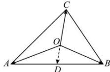

> [!faq]- 全练一本通解析
> **【答案】** D
>
> **【解析】**
> 解析:取线段 AB 的中点 D, 连接 OD, 则 $\overrightarrow{OA} + \overrightarrow{OB} = 2\overrightarrow{OD}$ ,
> $$
> \overrightarrow {O A} + \overrightarrow {O B} + \overrightarrow {O C} = \vec {0}
> $$
> 
> 因此 $\overrightarrow{CO}=2\overrightarrow{OD}$ ，即 C, O, D 三点共线，线段 CD 是 $\triangle ABC$ 的中线，且 O 是靠近中点 D 的三等分点，所以 O 是 $\triangle ABC$ 的重心。
>
> 故选 **D**
