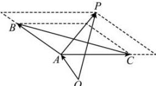

> [!faq]- 全练一本通解析
> **【答案】** A
>
> **【解析】**
> 解析：由题意 $\overrightarrow{AP}=\lambda(\overrightarrow{AB}+\overrightarrow{AC})$ ，当 $\lambda\in(0,+\infty)$ 时，由于 $\lambda(\overrightarrow{AB}+\overrightarrow{AC})$ 表示 BC 边上的中线所在直线的向量，
> 动点 P 的轨迹一定通过 $\triangle ABC$ 的重心，如图，故选 A。
> ∴动点 P 的轨迹一定通过 $\triangle ABC$ 的重心, 如图, 故选 A.
> 
