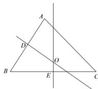

> [!faq]- 全练一本通解析
> **【答案】** D
>
> **【解析】**
> 解析: 分别取 AB 的中点为 D, BC 的中点为 E, 如图所示
> 
> 则 $\overrightarrow{OA} +\overrightarrow{OB} = 2\overrightarrow{OD}$ ， $\overrightarrow{OB} +\overrightarrow{OC} = 2\overrightarrow{OE}$
> 由 $(\overrightarrow{OA} +\overrightarrow{OB})\cdot \overrightarrow{AB} = 0$ 得 $2\overrightarrow{OD}\cdot \overrightarrow{AB} = 0$
> 所以 $OD \perp AB$ ，所以 OD 垂直平分线段 AB
> 由 $(\overrightarrow{OB} +\overrightarrow{OC})\cdot \overrightarrow{BC} = 0$ 得 $2\overrightarrow{OE}\cdot \overrightarrow{BC} = 0$
> 所以 $OE \perp BC$ ，所以 $OE$ 垂直平分线段 $BC$
> 所以点 O 为 $\triangle ABC$ 的外心.
>
> 故选 **D**.
