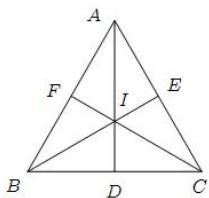

> [!faq]- 全练一本通解析
> **【答案】** C
>
> **【解析】**
> 解析: 延长 AI, BI, CI, 分别交 BC, AC, AB 于 D, E, F. 内心是三角形三个内角的角平分线的交点.
> $$
> \frac {B D}{\sin \left(\frac {1}{2} \angle B A C\right)} = \frac {c}{\sin \angle A D B}, \frac {C D}{\sin \left(\frac {1}{2} \angle B A C\right)} = \frac {b}{\sin \angle A D C},
> $$
> 由于 $\sin\angle ADB=\sin\angle ADC$ ，所以
> $$
> \frac {B D}{c} = \frac {C D}{b}, \frac {B D}{C D} = \frac {c}{b}, \frac {B D}{B D + C D} = \frac {c}{b + c}, \frac {B D}{a} = \frac {c}{b + c}, B D = \frac {a c}{b + c},
> $$
> 同理可得 $\frac{c}{BD}=\frac{AI}{DI}$ ， $\frac{c}{BD+c}=\frac{AI}{DI+AI}=\frac{AI}{AD}$ ，
> $$
> A I = \frac {c \cdot A D}{B D + c} = \frac {c}{\frac {a c}{b + c} + c} \cdot A D = \frac {b + c}{a + b + c} \cdot A D
> $$
> 所以 $\overrightarrow{AD} = \overrightarrow{AB} +\overrightarrow{BD} = \overrightarrow{AB} +\frac{c}{b + c}\overrightarrow{BC} = \overrightarrow{AB} +\frac{c}{b + c}\Big(\overrightarrow{AC} -\overrightarrow{AB}\Big)$
> $$
> = \frac {b}{b + c} \overrightarrow {A B} + \frac {c}{b + c} \overrightarrow {A C}
> $$
> 则 $\overrightarrow{AI} = \frac{b + c}{a + b + c}\cdot \overrightarrow{AD} = \frac{b + c}{a + b + c}\cdot \left(\frac{b}{b + c}\overrightarrow{AB} +\frac{c}{b + c}\overrightarrow{AC}\right)$
> $= \frac{b}{a + b + c}\overrightarrow{AB} +\frac{c}{a + b + c}\overrightarrow{AC}$ .故选：C
> 
