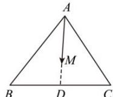
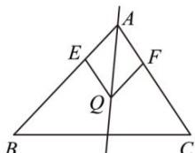
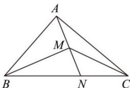

> [!faq]- 全练一本通解析
> **【答案】** BCD
>
> **【解析】**
> 解析: 对于 A 选项, 因为 $\overrightarrow{AM} = 2\overrightarrow{AB} - \overrightarrow{AC}$ , 则 $\overrightarrow{AM} - \overrightarrow{AB} = \overrightarrow{AB} - \overrightarrow{AC}$ , 可得 $\overrightarrow{BM} = \overrightarrow{CB}$ ,
> 所以，点 M 在射线 CB 上，且点 B 为线段 CM 的中点，A 错；
> 对于 B 选项，设点 D 为线段 BC 的中点，
> 
> 则 $\overrightarrow{AD} = \overrightarrow{AB} + \overrightarrow{BD} = \overrightarrow{AB} + \frac{1}{2}\overrightarrow{BC} = \overrightarrow{AB} + \frac{1}{2}\left(\overrightarrow{AC} - \overrightarrow{AB}\right) = \frac{1}{2}\overrightarrow{AB} + \frac{1}{2}\overrightarrow{AC}$ ，
> 因为 $\overrightarrow{AM}=\frac{1}{3}\overrightarrow{AB}+\frac{1}{3}\overrightarrow{AC}=\frac{2}{3}\left(\frac{1}{2}\overrightarrow{AB}+\frac{1}{2}\overrightarrow{AC}\right)=\frac{2}{3}\overrightarrow{AD}$ ，
> 此时点 M 为 $\triangle ABC$ 重心，B 对；
> 对于 C 选项，因为 $\overrightarrow{OM}=\overrightarrow{OA}+\lambda\left(\frac{\overrightarrow{AB}}{\left|\overrightarrow{AB}\right|}+\frac{\overrightarrow{AC}}{\left|\overrightarrow{AC}\right|}\right)\left(\lambda\in\mathbf{R}\right)$ 则 $\overrightarrow{OM}-\overrightarrow{OA}=\overrightarrow{AM}=\lambda\left(\frac{\overrightarrow{AB}}{\left|\overrightarrow{AB}\right|}+\frac{\overrightarrow{AC}}{\left|\overrightarrow{AC}\right|}\right)\left(\lambda\in\mathbf{R}\right)$
> 
> 因为 $\overrightarrow{AB}$ 、 $\overrightarrow{AC}$ 分别是与 $\overrightarrow{AB}$ 、 $\overrightarrow{AC}$ 方向相同的单位向量，
> 记住 $\overrightarrow{AE}=\frac{\overrightarrow{AB}}{\left|\overrightarrow{AB}\right|}$ ， $\overrightarrow{AF}=\frac{\overrightarrow{AC}}{\left|\overrightarrow{AC}\right|}$ ，以 AE、AF 为邻边作平行四边形 AEQF，
> 则四边形 AEQF 为菱形，则 AQ 平分 $\angle BAC$ ，且 $\frac{\overrightarrow{AB}}{\left|\overrightarrow{AB}\right|}+\frac{\overrightarrow{AC}}{\left|\overrightarrow{AC}\right|}=\overrightarrow{AQ}$ 即 $\overrightarrow{OM}-\overrightarrow{OA}=\overrightarrow{AM}=\lambda\left(\frac{\overrightarrow{AB}}{\left|\overrightarrow{AB}\right|}+\frac{\overrightarrow{AC}}{\left|\overrightarrow{AC}\right|}\right)=\lambda\overrightarrow{AQ}\left(\lambda\in\mathbf{R}\right)$ 此时，点 M 的轨迹必过 $\triangle ABC$ 的内心，C 对；
> 对于 D 选项，因为 $\overrightarrow{AM}=x\overrightarrow{AB}+y\overrightarrow{AC}$ ，且 $x+y=\frac{1}{2}$ 所以 $2\overrightarrow{AM}=2x\overrightarrow{AB}+2y\overrightarrow{AC}$ ，且 $2x+2y=1$ 设 $\overrightarrow{AN}=2\overrightarrow{AM}$ ，则 $\overrightarrow{AN}=2x\overrightarrow{AB}+2y\overrightarrow{AC}=2x\overrightarrow{AB}+\left(1-2x\right)\overrightarrow{AC}$ 即 $\overrightarrow{AN}-\overrightarrow{AC}=2x\left(\overline{AB}-\overline{AC}\right)$ ，即 $\overrightarrow{CN}=2x\overrightarrow{CB}$ ，所以，N、B、C 三点共线，
> 又因为 $\overrightarrow{AN}=2\overrightarrow{AM}$ ，所以 M 为 AN 的中点，如图所示：
> 
> 所以 $S_{\triangle MBC} = \frac{1}{2} S_{\triangle ABC}$ ，故 D 正确。
>
> 故选 **BCD**。
