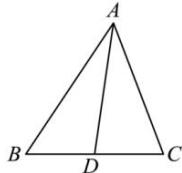
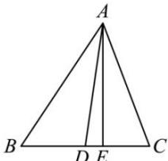

> [!faq]- 全练一本通解析
> **【答案】** AC
>
> **【解析】**
> 解析：对于 A，因为 $\overrightarrow{AP}=\lambda\left(\frac{\overrightarrow{AB}}{m\left|\overrightarrow{AB}\right|}+\frac{\overrightarrow{AC}}{n\left|\overrightarrow{AC}\right|}\right)$ ， $m\left|\overrightarrow{AB}\right|=n\left|\overrightarrow{AC}\right|=1$ ，所以 $\overrightarrow{AP}=\lambda\left(\overrightarrow{AB}+\overrightarrow{AC}\right)$ ，
> 设点 D 为 BC 的中点，所以 $\overrightarrow{AB}+\overrightarrow{AC}=2\overrightarrow{AD}$ ，
> 所以 $\overrightarrow{AP}=2\lambda\overrightarrow{AD}$ ，所以直线 AP 一定经过 $\triangle ABC$ 的重心，所以 A 正确，
> 
> 对于 B, 当 m=n=1 时， $\overrightarrow{AP}=\lambda\left(\frac{\overrightarrow{AB}}{\left|\overrightarrow{AB}\right|}+\frac{\overrightarrow{AC}}{\left|\overrightarrow{AC}\right|}\right)$ 因为 $\overrightarrow{AB}$ 为与 $\overrightarrow{AB}$ 同方向的单位向量， $\frac{\overrightarrow{AC}}{\left|\overrightarrow{AC}\right|}$ 为与 $\overrightarrow{AC}$ 同方向的单位向量，所以 $\frac{\overrightarrow{AB}}{\left|\overrightarrow{AB}\right|}+\frac{\overrightarrow{AC}}{\left|\overrightarrow{AC}\right|}$ 平分 $\angle BAC$ ，
> 所以直线 AP 一定经过 $\triangle ABC$ 的内心，所以 B 错误，
> 对于 C, 当 $m = \cos B$ , $n = \cos C$ 时， $\overrightarrow{AP} = \lambda \left( \frac{\overrightarrow{AB}}{\cos B \left| \overrightarrow{AB} \right|} + \frac{\overrightarrow{AC}}{\cos C \left| \overrightarrow{AC} \right|} \right)$ ,
> 所以 $\overrightarrow{AP}\cdot\overrightarrow{BC}=\lambda\left(\frac{\overrightarrow{AB}\cdot\overrightarrow{BC}}{\cos B\left|\overrightarrow{AB}\right|}+\frac{\overrightarrow{AC}\cdot\overrightarrow{BC}}{\cos C\left|\overrightarrow{AC}\right|}\right)=\lambda\left(\frac{-\left|\overrightarrow{AB}\right|\cdot\left|\overrightarrow{BC}\right|\cos B}{\cos B\left|\overrightarrow{AB}\right|}+\frac{\left|\overrightarrow{AC}\right|\cdot\left|\overrightarrow{BC}\right|\cos C}{\cos C\left|\overrightarrow{AC}\right|}\right)=0,$ 所以 $\overrightarrow{AP} \perp \overrightarrow{BC}$ ，所以直线 AP 一经过 $\triangle ABC$ 的垂心，所以 C 正确，
> 对于 D, 当 $m = \sin B$ , $n = \sin C$ 时， $\overrightarrow{AP} = \lambda \left( \frac{\overrightarrow{AB}}{\sin B\left|\overrightarrow{AB}\right|} + \frac{\overrightarrow{AC}}{\sin C\left|\overrightarrow{AC}\right|} \right)$ ,
> 作 $AE \perp BC$ 于 E，则 $\sin B\left|\overrightarrow{AB}\right|=\left|AE\right|$ ， $\sin C\left|\overrightarrow{AC}\right|=\left|AE\right|$ ，
> 所以 $\overrightarrow{AP}=\lambda\left(\frac{\overrightarrow{AB}}{\left|\overrightarrow{AE}\right|}+\frac{\overrightarrow{AC}}{\left|\overrightarrow{AE}\right|}\right)=\frac{\lambda}{\left|\overrightarrow{AE}\right|}\left(\overrightarrow{AB}+\overrightarrow{AC}\right)=\frac{2\lambda}{\left|\overrightarrow{AE}\right|}\overrightarrow{AD}$ 所以直线 AP 一定经过 $\triangle ABC$ 的重心, 所以 D 错误, 故选: AC
> 
