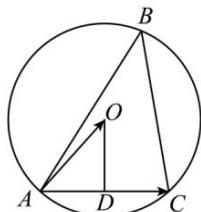

> [!faq]- 全练一本通解析
> **【答案】** D
>
> **【解析】**
> 解析:如图, 设 D 为 AC 的中点, 则 $AD = \frac{1}{2} AC$ ,
> 所以 $\overrightarrow{AO}\cdot\overrightarrow{AC}=\left|\overrightarrow{AO}\right|\cdot\left|\overrightarrow{AC}\right|\cos\angle OAD=\left|\overrightarrow{AD}\right|\cdot\left|\overrightarrow{AC}\right|=\frac{1}{2}\overrightarrow{AC}^{2}$ 同理可得 $\overrightarrow{AO}\cdot\overrightarrow{AB}=\frac{1}{2}\overrightarrow{AB}^{2}$
> 
> 所以 $\overrightarrow{AO}\cdot\overrightarrow{BC}=\overrightarrow{AO}\cdot\left(\overrightarrow{AC}-\overrightarrow{AB}\right)=\overrightarrow{AO}\cdot\overrightarrow{AC}-\overrightarrow{AO}\cdot\overrightarrow{AB}=\frac{1}{2}\overrightarrow{AC}^{2}-\frac{1}{2}\overrightarrow{AB}^{2}=$ $=\frac{1}{2}\times2^{2}-\frac{1}{2}\times3^{2}=-\frac{5}{2}$ .
>
> 故选 **D**.
