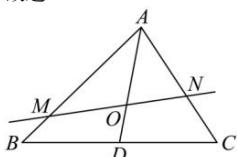

> [!faq]- 全练一本通解析
> **【答案】** A
>
> **【解析】**
> 解析：如图所示，由三角形重心的性质，可得 $\frac{\overrightarrow{AO}}{\overline{AD}} = \frac{2}{3}$ ，所以 $\overline{\overline{AD}} = \frac{3}{2}\overline{\overline{AO}}$ 所以 $\frac{3}{2}\overline{\overline{AO}} = x\overline{\overline{AM}} +y\overline{\overline{AN}}$ ，即 $\overline{\overline{AO}} = \frac{2}{3} x\overline{\overline{AM}} +\frac{2}{3} y\overline{\overline{AN}}$ 因为 $M,O,N$ 三点共线，可得 $\frac{2}{3} x + \frac{2}{3} y = 1$ ，所以 $x + y = \frac{3}{2}$ 故选：A.
> 
