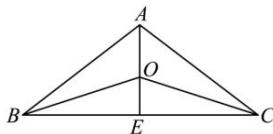

> [!faq]- 全练一本通解析
> **【答案】** B
>
> **【解析】**
> 解析:取 BC 的中点 E, 连 AE,
> 因为 AB = AC = 5, BC = 8, 所以 $AE \perp BC$ , $AE = \sqrt{5^{2} - 4^{2}} = 3$ ,
> 所以 $\triangle ABC$ 的内心 O 在线段 AE 上，OE 为内切圆的半径，
> 因为 $S_{\triangle ABC}=S_{\triangle AOB}+S_{\triangle AOC}+S_{\triangle BOC}$ 所以 $\frac{1}{2}AE\cdot BC=\frac{1}{2}OE\cdot(AB+AC+BC)$ ,
> 所以 $\frac{1}{2}\times3\times8=\frac{1}{2}OE\cdot(5+5+8)$ ，得 $OE=\frac{4}{3}$ ，
> 所以 AO=AE-OE=3- $\frac{4}{3}=\frac{5}{3}$ 所以 $\overrightarrow{AO}=\frac{5}{9}\overrightarrow{AE}$ 又 $\overrightarrow{AE}=\frac{1}{2}\left(\overrightarrow{AB}+\overrightarrow{AC}\right)$ ，所以 $\overrightarrow{AO}=\frac{5}{18}\overrightarrow{AB}+\frac{5}{18}\overrightarrow{AC}$ 又已知 $\overrightarrow{AO}=m\overrightarrow{AB}+n\overrightarrow{AC}$ ，所以 $m=n=\frac{5}{18}$ ，所以 $m+n=\frac{5}{9}$ .
> 
