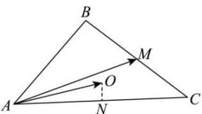

> [!faq]- 全练一本通解析
> **【答案】** B
>
> **【解析】**
> 解析:由题意,取 AC 的中点为 N, 连接 ON, 如下图所示:
> 
> 易知 $ON \perp AC$ ， $\overrightarrow{AM} = \frac{1}{2}\left(\overrightarrow{AB} + \overrightarrow{AC}\right)$ ；
> 可得 $\overrightarrow{AM} \cdot \overrightarrow{AO} = \frac{1}{2}\left(\overrightarrow{AB} + \overrightarrow{AC}\right) \cdot \overrightarrow{AO} = \frac{1}{2}\left(\overrightarrow{AB} \cdot \overrightarrow{AO} + \overrightarrow{AC} \cdot \overrightarrow{AO}\right)$ ，
> 又 $\overrightarrow{AC} \cdot \overrightarrow{AO} = |\overrightarrow{AC}| \cdot |\overrightarrow{AO}| \cos \angle CAO = |\overrightarrow{AC}| \cdot |\overrightarrow{AN}| = \frac{1}{2} |\overrightarrow{AC}|^2$ ，同理 $\overrightarrow{AB} \cdot \overrightarrow{AO} = \frac{1}{2} |\overrightarrow{AB}|^2$ ；
> 所以 $\overrightarrow{AM} \cdot \overrightarrow{AO} = \frac{1}{4} (\overrightarrow{AB}^2 + \overrightarrow{AC}^2) = \frac{17}{2}$
>
> 故选 **B**
