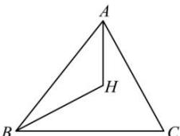

> [!faq]- 全练一本通解析
> **【答案】** C
>
> **【解析】**
> 解析: 因为 $\sin^{2}A + \sin^{2}C = \sin^{2}B + \sin A \cdot \sin C$ 所以由正弦定理得 $a^{2} + c^{2} = b^{2} + ac$ 所以由余弦定理得 $\cos B = \frac{a^{2} + c^{2} - b^{2}}{2ac} = \frac{ac}{2ac} = \frac{1}{2}$ 因为 $B \in (0, \pi)$ ，所以 $B = \frac{\pi}{3}$ 因为 H 是 $\triangle ABC$ 的垂心，所以 $\overrightarrow{BC} \cdot \overrightarrow{AH} = 0$ 因为 $\overrightarrow{BC} \cdot \overrightarrow{BH} = \overrightarrow{BC} \cdot (\overrightarrow{BA} + \overrightarrow{AH}) = \overrightarrow{BC} \cdot \overrightarrow{BA} + \overrightarrow{BC} \cdot \overrightarrow{AH} = \overrightarrow{BC} \cdot \overrightarrow{BA} = 8$ 所以 $\left|\overrightarrow{BC}\right| \cdot \left|\overrightarrow{BA}\right| \cos B = 8$ ，所以 $\left|\overrightarrow{BC}\right| \cdot \left|\overrightarrow{BA}\right| = 16$ 所以 $S_{zABC}=\frac{1}{2}\left|\overrightarrow{BA}\right|\left|\overrightarrow{BC}\right|\sin B=\frac{1}{2}\times16\times\frac{\sqrt{3}}{2}=4\sqrt{3}$ ，故选: C
> 
