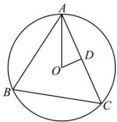

> [!faq]- 全练一本通解析
> **【答案】** D
>
> **【解析】**
> 解析: 设 AC 的中点为 D, 由 O 为 $\triangle ABC$ 的外心可得, $OD \perp AC$ , $\overrightarrow{AO}\cdot\overrightarrow{AC}=\left(\overrightarrow{AD}+\overrightarrow{DO}\right)\cdot\overrightarrow{AC}=\overrightarrow{AD}\cdot\overrightarrow{AC}=3\times6=18$ 又 $\overrightarrow{AO}\cdot\overrightarrow{AC}=\left(\frac{1}{6}\overrightarrow{AB}+\frac{4}{9}\overrightarrow{AC}\right)\cdot\overrightarrow{AC}=\frac{1}{6}\overrightarrow{AB}\cdot\overrightarrow{AC}+\frac{4}{9}\overrightarrow{AC^{2}}=\frac{1}{6}\overrightarrow{AB}\cdot\overrightarrow{AC}+16$ 所以 $\overrightarrow{AB}\cdot\overrightarrow{AC}=12$ 又 $\overrightarrow{AB}\cdot\overrightarrow{AC}=\left|\overrightarrow{AB}\right|\cdot\left|\overrightarrow{AC}\right|\cdot\cos\angle BAC=4\times6\times\cos\angle BAC=12$ ，可得 $\cos\angle BAC=\frac{1}{2}$ 故 $\sin\angle BAC=\frac{\sqrt{3}}{2}$ ，则 $\triangle ABC$ 的面积为 $\frac{1}{2}\cdot\left|AB\right|\cdot\left|AC\right|\cdot\sin\angle BAC=\frac{1}{2}\times4\times6\times\frac{\sqrt{3}}{2}=6\sqrt{3}$ ，故选:D.
> 
