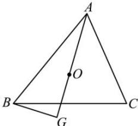

> [!faq]- 全练一本通解析
> **【答案】** B
>
> **【解析】**
> 解析:如图,
> 
> $\overrightarrow{AO}\cdot\overrightarrow{AG}=\overrightarrow{AO}\cdot(\overrightarrow{AB}+\overrightarrow{BG})=\overrightarrow{AO}\cdot\overrightarrow{AB}+\overrightarrow{AO}\cdot\overrightarrow{BG}$ 因为 $BG \perp AO \Rightarrow \overrightarrow{AO} \cdot \overrightarrow{BG} = 0$ 所以 $\overrightarrow{AO} \cdot \overrightarrow{AG} = \overrightarrow{AO} \cdot \overrightarrow{AB}$ 又因为 O 是三角形的外心，
> 所以 $|\overrightarrow{AO}| \cos \angle BAO = \frac{1}{2} |\overrightarrow{AB}|$ 所以 $\overrightarrow{AO} \cdot \overrightarrow{AG} = \overrightarrow{AO} \cdot \overrightarrow{AB} = |\overrightarrow{AB}| \overrightarrow{AO} | \cos \angle BAO = \frac{1}{2} |\overrightarrow{AB}|^{2} = \frac{1}{2} \times 16 = 8$ .
>
> 故选 **B**
