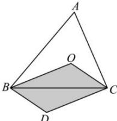

> [!faq]- 全练一本通解析
> **【答案】** D
>
> **【解析】**
> 解析:由 $\overrightarrow{OP}=x\overrightarrow{OB}+y\overrightarrow{OC}$ ， $x,y\in[0,1]$ ，
> 根据向量加法的平行四边形法则可知:动点 P 的轨迹是以 OB，OC 为邻边的平行四边形 OBDC 及其内部，其面积为 $\triangle BOC$ 的面积的 2 倍.
> 
> 在 $\triangle ABC$ 中, 设内角 $A, B, C$ 所对的边分别为 $a, b, c$ , 由余弦定理 $a^2 = b^2 + c^2 - 2bc \cos A = 16 + 25 - 2 \times 4 \times 5 \times \frac{1}{8} = 36$ , 得 $a = 6$ . 设 $\triangle ABC$ 的内切圆的半径为 $r$ , 则 $\frac{1}{2} bc \sin A = \frac{1}{2}(a + b + c)r$ , 所以 $4 \times 5 \times \frac{3\sqrt{7}}{8} = 15r$ , 解得 $r = \frac{\sqrt{7}}{2}$ , 所以 $S_{\triangle BOC} = \frac{1}{2} \times a \times r = \frac{1}{2} \times 6 \times \frac{\sqrt{7}}{2} = \frac{3\sqrt{7}}{2}$ . 故动点 $P$ 的轨迹所覆盖图形的面积为 $2S_{\triangle BOC} = 3\sqrt{7}$ .
>
> 故选 **D**.
