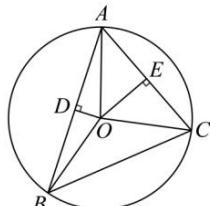

> [!faq]- 全练一本通解析
> **【答案】** C
>
> **【解析】**
> 解析: 由题意可知, $O$ 为 $\triangle ABC$ 的外心, 设外接圆半径为 $r$ , 在圆 $O$ 中, 过 $O$ 作 $OD \perp AB$ , $OE \perp AC$ , 垂足分别为 $D, E$ , 则 $D, E$ 分别为 $AB, AC$ 的中点,
> 
> 因为 $\overrightarrow{AO} = \lambda \overrightarrow{AB} + \mu \overrightarrow{AC}$ ，两边乘以 $\overrightarrow{AB}$ ，即 $\overrightarrow{AO} \cdot \overrightarrow{AB} = \lambda \overrightarrow{AB}^{2} + \mu \overrightarrow{AC} \cdot \overrightarrow{AB}$ ， $\overrightarrow{AO},\overrightarrow{AB}$ 的夹角为 $\angle OAD$ ，而 $\cos\angle OAD=\frac{AD}{AO}=\frac{\frac{6}{2}}{r}=\frac{3}{r}$ 则 $r \times 6 \times \frac{3}{r} = 36\lambda + \mu \times 4 \times 6 \times \frac{1}{2}$ ，得 $6\lambda + 2\mu = 3$ ①，
> 同理 $\overrightarrow{AO} = \lambda \overrightarrow{AB} + \mu \overrightarrow{AC}$ 两边乘 $\overrightarrow{AC}$ ，即 $\overrightarrow{AO}\cdot\overrightarrow{AC}=\lambda\overrightarrow{AB}\cdot\overrightarrow{AC}+\mu\overrightarrow{AC}^{2},\cos\angle OAC=\frac{2}{r},$ 则 $r\times4\times\frac{2}{r}=\lambda\times6\times4\times\frac{1}{2}+16\mu,$ 得 $3\lambda+4\mu=2$ ②,
> - **①**：②联立解得 $\lambda=\frac{4}{9},\mu=\frac{1}{6}$ ，所以 $\lambda+\mu=\frac{4}{9}+\frac{1}{6}=\frac{11}{18}$ .
>
> 故选 **C**.
