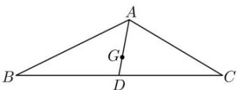

> [!faq]- 全练一本通解析
> **【答案】** D
>
> **【解析】**
> 解析:取 BC 的中点为 D，连接 AD，如下图所示:
> 
> 因为 G 为三角形 ABC 的重心, 所以 $\overrightarrow{AG} = \frac{2}{3}\overrightarrow{AD} = \frac{1}{3}\left(\overrightarrow{AB} + \overrightarrow{AC}\right)$ ,
> 因为 $\angle BAC=\frac{2\pi}{3}$ ， $\overrightarrow{AB}\cdot\overrightarrow{AC}=-2$ 所以， $\overrightarrow{AB}\cdot\overrightarrow{AC}=\left|\overrightarrow{AB}\right|\cdot\left|\overrightarrow{AC}\right|\cos\frac{2\pi}{3}=-2$ 所以 $\left|\overrightarrow{AB}\right|\cdot\left|\overrightarrow{AC}\right|=4$ 又 $\left|\overrightarrow{AG}\right|=\frac{1}{3}\left|\overrightarrow{AB}+\overrightarrow{AC}\right|=\frac{1}{3}\sqrt{\left(\overrightarrow{AB}+\overrightarrow{AC}\right)^{2}}$ $=\frac{1}{3}\sqrt{\left|\overrightarrow{AB}\right|^{2}+\left|\overrightarrow{AC}\right|^{2}+2\overrightarrow{AB}\cdot\overrightarrow{AC}}=\frac{1}{3}\sqrt{\left|\overrightarrow{AB}\right|^{2}+\left|\overrightarrow{AC}\right|^{2}-4}$ $\geq\frac{1}{3}\sqrt{2\left|\overrightarrow{AB}\right|\cdot\left|\overrightarrow{AC}\right|-4}=\frac{2}{3}$ ，当且仅当 $\left|\overrightarrow{AB}\right|=\left|\overrightarrow{AC}\right|=2$ 时取等号；
>
> 故选 **D**.
