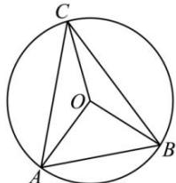

> [!faq]- 全练一本通解析
> **【答案】** $\frac{\sqrt{10}}{4}$
>
> **【解析】**
> 因为O为 $\triangle ABC$ 的外心,又由 $2\overrightarrow{OA}+3\overrightarrow{OB}=-4\overrightarrow{OC}$ 平方可得： $4\overrightarrow{OA^{2}}+12\overrightarrow{OA}\cdot\overrightarrow{OB}+9\overrightarrow{OB^{2}}=16\overrightarrow{OC^{2}}$ 不妨设 $|\overrightarrow{OA}|=|\overrightarrow{OB}|=|\overrightarrow{OC}|=1$ ，则 $\overrightarrow{OA}\cdot\overrightarrow{OB}=\cos\angle AOB=\frac{1}{4}>0$ 故∠AOB为锐角，
> 由于 $\angle AOB = 2C$ ，或 $\angle AOB = 2(\pi - C)$ 又由： $2\overrightarrow{OA} + 3\overrightarrow{OB} + 4\overrightarrow{OC} = \overrightarrow{0}$ 可得点 O 在 $\triangle ABC$ 的内部，即 $\triangle ABC$ 为锐角三角形，
> 
> 故 $\angle AOB = 2C, C$ 为锐角，即 $\cos 2C = 2\cos^2 C - 1 = \frac{1}{4}$ ，故 $\cos C = \frac{\sqrt{10}}{4}$ ，故答案为： $\frac{\sqrt{10}}{4}$
