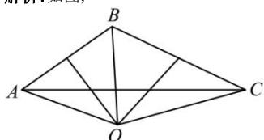

> [!faq]- 全练一本通解析
> **【答案】** 7
>
> **【解析】**
> 如图,
> 
> ∵ AB=6, BC=8, $B=\frac{2\pi}{3}$ , 且 $\overrightarrow{BO}=x\overrightarrow{BA}+y\overrightarrow{BC}$ ,
> ∴ $\overrightarrow{BO}\cdot\overrightarrow{BA}=|\overrightarrow{BO}|\cdot|\overrightarrow{BA}|\cdot\cos\angle ABO=\frac{1}{2}|\overrightarrow{BA}|^{2}=18$ $\overrightarrow{BO}\cdot\overrightarrow{BC}=|\overrightarrow{BO}||\overrightarrow{BC}|\cdot\cos\angle CBO=\frac{1}{2}|\overrightarrow{BC}|^{2}=32,\quad\overrightarrow{BA}\cdot\overrightarrow{BC}=6\times8\times(-\frac{1}{2})=-24,$ $\therefore\left\{\begin{aligned}\overrightarrow{BO}\cdot\overrightarrow{BA}&=x\overrightarrow{BA}^{2}+y\overrightarrow{BA}\cdot\overrightarrow{BC}\\ \overrightarrow{BO}\cdot\overrightarrow{BC}&=x\overrightarrow{BA}\cdot\overrightarrow{BC}+y\overrightarrow{BC}^{2}\end{aligned}\right.$ $\therefore\left\{\begin{aligned}18&=36x-24y\\ 32&=-24x+64y\end{aligned}\right.$ ，整理得， $\left\{\begin{aligned}6x-4y&=3\\ 8y-3x&=4\end{aligned}\right.$ $\therefore(6x-4y)+(8y-3x)=3x+4y=7$ ．故答案为：7
