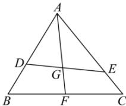

> [!faq]- 全练一本通解析
> **【答案】** D
>
> **【解析】**
> 6
> 解析：因为点G为△ABC的重心，所以 $AG=\frac{2}{3}AF$ ，则 $\overrightarrow{AF}=\frac{3}{2}\overrightarrow{AG}$ ．
> 因为D,G,E三点共线， $\overrightarrow{AG}=\frac{2}{3}\overrightarrow{AF}=m\overrightarrow{AD}+(1-m)\overrightarrow{AE}$ ，
> 所以 $\lambda=\frac{3}{2}m,\mu=\frac{3}{2}(1-m)$ ．
> 
> 所以 $\lambda +\mu = \frac{3}{2},\lambda ,\mu \in (0,1]$ 所以 $\frac{1}{\lambda} +\frac{4}{\mu} = \left(\frac{1}{\lambda} +\frac{4}{\mu}\right)(\lambda +\mu)\cdot \frac{2}{3} = \frac{2}{3}\Bigg(5 + \frac{\mu}{\lambda} +\frac{4\lambda}{\mu}\Bigg)\geq \frac{2}{3}\Big(5 + 2\sqrt{4}\Big) = 6$ 当且仅当 $\frac{\mu}{\lambda} = \frac{4\lambda}{\mu}$ ，即 $\mu = 1$ ， $\lambda = \frac{1}{2}$ 时，等号成立，故 $\frac{1}{\lambda} +\frac{4}{\mu}$ 的最小值为6.
>
> 故选 **D**
