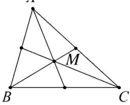
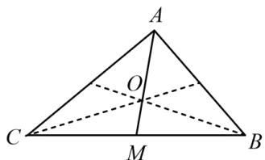
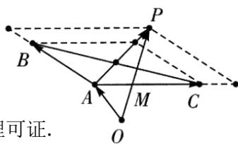

## 1. 三角形的重心

<table><tr><td rowspan="4">三角形重心</td><td>定义</td><td>图形</td><td>性质</td></tr><tr><td>三角形的三条中线交于一点,这点称为三角形的重心</td><td>A</td><td>三角形的重心到边的中点与到相应顶点的距离之比为1:2重心和三角形3个顶点组成的3个三角形面积相等重心到三角形3个顶点距离的平方和最小</td></tr><tr><td colspan="3">重心的向量式表示</td></tr><tr><td colspan="3">设O是△ABC的重心,P为平面内任意一点1 $\overrightarrow{OA}+\overrightarrow{OB}+\overrightarrow{OC}=\overrightarrow{0}$ 或 $\overrightarrow{AO}+\overrightarrow{BO}+\overrightarrow{CO}=\overrightarrow{0}$ 2 $\overrightarrow{AO}=\frac{1}{3}(\overrightarrow{AB}+\overrightarrow{AC})$ 3 $\overrightarrow{PO}=\frac{1}{3}(\overrightarrow{PA}+\overrightarrow{PB}+\overrightarrow{PC})$ 4若 $\overrightarrow{AP}=\lambda(\overrightarrow{AB}+\overrightarrow{AC})$ 或 $\overrightarrow{OP}=\overrightarrow{OA}+\lambda(\overrightarrow{AB}+\overrightarrow{AC}),\lambda\in[0,+\infty)$ ,则P一定经过三角形的重心5若 $\overrightarrow{AP}=\lambda\left(\frac{\overrightarrow{AB}}{|\overrightarrow{AB}|\sin B}+\frac{\overrightarrow{AC}}{|\overrightarrow{AC}|\sin C}\right)$ 或 $\overrightarrow{OP}=\overrightarrow{OA}+\lambda\left(\frac{\overrightarrow{AB}}{|\overrightarrow{AB}|\sin B}+\frac{\overrightarrow{AC}}{|\overrightarrow{AC}|\sin C}\right)\lambda\in[0,+\infty)$ ,则P一定经过三角形的重心</td></tr></table>

重心向量式证明：

证明①:

设 $O(x,y), A(x_{1},y_{1}), B(x_{2},y_{2}), C(x_{3},y_{3})$ .

$\overrightarrow{OA} + \overrightarrow{OB} + \overrightarrow{OC} = \mathbf{0} \Leftrightarrow \left\{ \begin{array}{l} (x_1 - x) + (x_2 - x) + (x_3 - x) = 0 \\ (y_1 - y) + (y_2 - y) + (y_3 - y) = 0 \end{array} \right. \Leftrightarrow \left\{ \begin{array}{l} x = \frac{x_1 + x_2 + x_3}{3} \\ y = \frac{y_1 + y_2 + y_3}{3} \end{array} \right. \Leftrightarrow O$ 是 $\triangle ABC$ 重心

证明②:

取 BC 中点为 M， $\overrightarrow{AB} + \overrightarrow{AC} = 2\overrightarrow{AM}$ ，故 $\overrightarrow{AO} = \frac{1}{3} (\overrightarrow{AB} + \overrightarrow{AC}) = \frac{2}{3}\overrightarrow{AM}$ ，根据三角形重心性质，可得 O 是 $\triangle ABC$ 的重心.

证明③:

在 $\triangle ABC$ 中 $\left\{ \begin{array}{l} \overrightarrow{PO} = \overrightarrow{PA} + \overrightarrow{AO} \\ \overrightarrow{PO} = \overrightarrow{PB} + \overrightarrow{BO} \\ \overrightarrow{PO} = \overrightarrow{PC} + \overrightarrow{CO} \end{array} \right.$ 三式相加得 $3\overrightarrow{PO} = \overrightarrow{PA} + \overrightarrow{AO} + \overrightarrow{PB} + \overrightarrow{BO} + \overrightarrow{PC} + \overrightarrow{CO}$ ，因为 $\overrightarrow{PO} = \frac{1}{3} (\overrightarrow{PA} + \overrightarrow{PB} + \overrightarrow{PC})$ ，即 $3\overrightarrow{PO} = \overrightarrow{PA} + \overrightarrow{PB} + \overrightarrow{PC}$ ，故 $\overrightarrow{AO} + \overrightarrow{BO} + \overrightarrow{CO} = \vec{0}$ ，所以 $O$ 是 $\triangle ABC$ 的重心.

证明④:

$\overrightarrow{AP} = \lambda (\overrightarrow{AB} +\overrightarrow{AC})$ ，当 $\lambda \in (0, + \infty)$ 时，由于 $\lambda (\overrightarrow{AB} +\overrightarrow{AC})$ 表示

BC 边上的中线所在直线的向量, 所以 $\overrightarrow{AP}$ 与 BC 边上的中线共线,

所以动点 P 的轨迹一定通过 $\triangle ABC$ 的重心. 如图.

$\overrightarrow{OP} = \overrightarrow{OA} + \lambda (\overrightarrow{AB} + \overrightarrow{AC})$ 可得 $\overrightarrow{OP} - \overrightarrow{OA} = \lambda (\overrightarrow{AB} + \overrightarrow{AC})$ ，即 $\overrightarrow{AP} = \lambda (\overrightarrow{AB} + \overrightarrow{AC})$ ，同理可证.

证明⑤：

$$
\because \overrightarrow {A P} = \lambda \left(\frac {\overrightarrow {A B}}{| \overrightarrow {A B} | \sin B} + \frac {\overrightarrow {A C}}{| \overrightarrow {A C} | \sin C}\right)
$$

∴ $\overrightarrow{AP}$ 与 $\frac{\overrightarrow{AB}}{|\overrightarrow{AB}|\sin B}+\frac{\overrightarrow{AC}}{|\overrightarrow{AC}|\sin C}$ 共线,

根据正弦定理: $\frac{|\overrightarrow{AB}|}{\sin C}=\frac{|\overrightarrow{AC}|}{\sin B}$ ，所以 $|\overrightarrow{AB}|\sin B=|\overrightarrow{AC}|\sin C$ ，

设 $|\overrightarrow{AB} |\sin B = |\overrightarrow{AC} |\sin C = k$

所以 $\overrightarrow{AP} = \frac{\lambda}{k}\left(\overrightarrow{AB} +\overrightarrow{AC}\right)$ ，所以 $\overrightarrow{AP}$ 与 $\overrightarrow{AB} +\overrightarrow{AC}$ 共线，

$\because \overrightarrow{AB} +\overrightarrow{AC}$ 经过线段 $BC$ 的中点 $D$ ，所以 $P$ 点的轨迹也过中点 $D$

∴点P过三角形重心.

$\overrightarrow{OP} = \overrightarrow{OA} + \lambda \left( \frac{\overrightarrow{AB}}{|\overrightarrow{AB}|\sin B} + \frac{\overrightarrow{AC}}{|\overrightarrow{AC}|\sin C} \right)$ 可得 $\overrightarrow{OP} - \overrightarrow{OA} = \overrightarrow{AP} = \lambda \left( \frac{\overrightarrow{AB}}{|\overrightarrow{AB}|\sin B} + \frac{\overrightarrow{AC}}{|\overrightarrow{AC}|\sin C} \right)$ ，同理可得.
