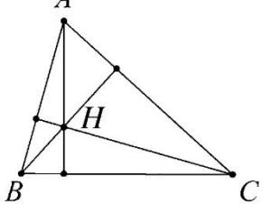

## 2. 三角形的垂心

<table><tr><td rowspan="4">三角形垂心</td><td>定义</td><td>图形</td><td>性质</td></tr><tr><td>三角形的三条高交于一点,这点称为三角形的垂心</td><td></td><td>1. 三角形任一顶点到垂心的距离,等于外心到对边的距离的2倍2. 锐角三角形的垂心到三顶点的距离之和等于其内切圆与外接圆半径之和的2倍3. 锐角三角形的垂心在三角形内;直角三角形的垂心在直角顶点上;钝角三角形的垂心在三角形外</td></tr><tr><td colspan="3">垂心的向量式表示</td></tr><tr><td colspan="3">设O是△ABC的垂心,P为平面内任意一点1 $\overrightarrow{OA} \cdot \overrightarrow{OB} = \overrightarrow{OB} \cdot \overrightarrow{OC} = \overrightarrow{OC} \cdot \overrightarrow{OA}$ 2 $|\overrightarrow{OA}|^{2} + |\overrightarrow{BC}|^{2} = |\overrightarrow{OB}|^{2} + |\overrightarrow{CA}|^{2} = |\overrightarrow{OC}|^{2} + |\overrightarrow{AB}|^{2}$ 3若 $\overrightarrow{AP} = \lambda \left( \frac{\overrightarrow{AB}}{|\overrightarrow{AB}| \cos B} + \frac{\overrightarrow{AC}}{|\overrightarrow{AC}| \cos C} \right)$ 或 $\overrightarrow{OP} = \overrightarrow{OA} + \lambda \left( \frac{\overrightarrow{AB}}{|\overrightarrow{AB}| \cos B} + \frac{\overrightarrow{AC}}{|\overrightarrow{AC}| \cos C} \right)$   $\lambda \in (0,+\infty)$ ,则动点P的轨迹一定通过△ABC的垂心</td></tr></table>

垂心向量式证明：

证明①:

由 $\overrightarrow{PA} \cdot \overrightarrow{PB} = \overrightarrow{PB} \cdot \overrightarrow{PC}$ ，得 $\overrightarrow{PB} \cdot (\overrightarrow{PA} - \overrightarrow{PC}) = 0$ ，即 $\overrightarrow{PB} \cdot \overrightarrow{CA} = 0$ ，所以 $\overrightarrow{PB} \perp \overrightarrow{CA}$ 。同理 $\overrightarrow{PC} \perp \overrightarrow{AB}, \overrightarrow{PA} \perp \overrightarrow{BC}$ 。所以 $P$ 是 $\triangle ABC$ 的垂心。

证明②:

已知 $|\overrightarrow{OA}|^2 + |\overrightarrow{BC}|^2 = |\overrightarrow{OB}|^2 + |\overrightarrow{CA}|^2 = |\overrightarrow{OC}|^2 + |\overrightarrow{AB}|^2$ 故 $|\overrightarrow{OA}|^2 - |\overrightarrow{OB}|^2 = |\overrightarrow{CA}|^2 - |\overrightarrow{BC}|^2$ ，所以 $\left(\overrightarrow{OA} + \overrightarrow{OB}\right)\left(\overrightarrow{OA} - \overrightarrow{OB}\right) = \left(\overrightarrow{CA} + \overrightarrow{BC}\right)\left(\overrightarrow{CA} - \overrightarrow{BC}\right) \therefore \left(\overrightarrow{OA} + \overrightarrow{OB}\right) \cdot \overrightarrow{BA} = \overrightarrow{BA} \cdot \left(\overrightarrow{CA} - \overrightarrow{BC}\right)$ ， $\therefore \left(\overrightarrow{OA} + \overrightarrow{OB} - \overrightarrow{CA} + \overrightarrow{BC}\right) \cdot \overrightarrow{BA} = \vec{0}$ ，即 $2\overrightarrow{OC} \cdot \overrightarrow{BA} = \vec{0}$ ，所以 $\overrightarrow{OC} \perp \overrightarrow{BA}$ 所以 $O$ 点在 $BA$ 边的高上，同理可证，所以 $O$ 为垂心

证明③:

由题意知 $\overrightarrow{AP} = \lambda \left(\frac{\overrightarrow{AB}}{|\overrightarrow{AB}|\cos B} +\frac{\overrightarrow{AC}}{|\overrightarrow{AC}|\cos C}\right)$ ，由于 $\left(\frac{\overrightarrow{AB}}{|\overrightarrow{AB}|\cos B} +\frac{\overrightarrow{AC}}{|\overrightarrow{AC}|\cos C}\right)\cdot \overrightarrow{BC}$

$= \frac{\overrightarrow{AB} \cdot \overrightarrow{BC}}{|\overrightarrow{AB}| \cos B} + \frac{\overrightarrow{AC} \cdot \overrightarrow{BC}}{|\overrightarrow{AC}| \cos C} = |\overrightarrow{BC}| - |\overrightarrow{CB}| = 0$ ，所以 $\overrightarrow{AP} \perp \overrightarrow{BC}$ ，即 $P$ 点在过点 $A$ 且垂直于 $BC$ 的直线上，所以动点 $P$ 的轨迹一定通过 $\triangle ABC$ 的垂心.
